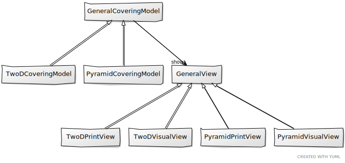

# Programátorská dokumentace

API dokumentace, vygenerovaná programem [Epydoc](http://epydoc.sourceforge.net/),
je dostupná na [samostatné stránce](https://jakoma02.github.io/pyCovering/).

PyCover generuje náhodné dílky pyramidových i obdélníkových (2D) skládačkových
hlavolamů. Program **negeneruje** (a ani si to neklade za cíl) dílky ani celá
rozložení **uniformně náhodně**, některá rozložení tedy může generovat častěji
než jiná.

Maximální rozměry pyramidy/obdélníku, které program dokáže pokrýt, nejsou pevně stanoveny,
jen může pokrývání větších rozměrů trvat neúměrné množství času. Vzhledem k randomizované
povaze programu se mohou také časy pokrývání modelu stejného modelu se stejnou konfigurací
drasticky měnit.

## Závislosti a použité nástroje
 - [VPython](https://vpython.org/)
 - [PySide2](https://wiki.qt.io/Qt_for_Python) (Qt 5), Qt designer
 - [Parameterized](https://github.com/wolever/parameterized) pro parametrické unit-testy
 - [Pylint](https://pylint.org/)
 - vim, git, ...

## Návrh
Kostru programu tvoří "model", který obsahuje samotnou logiku pokrývání. Pro zobrazení výsledku
pokrývání uživateli je pak použit "view". Tento návrh umožňuje rozbrazovat výsledky pokrývání
modelu různými způsoby, aniž by bylo potřeba měnit logiku modelu.

Velkou část pokrývací logiky se skrývá ve třídě `GeneralCoveringModel`, od které všechny modely dědí.
Jednotlivé modely pak jen reimplementují některé funkce (např. `neighbors(pos)`, která vrací všechny
sousedy zadané pozice, přesněji je to jejich generátor).

### Moduly
 - `pycovering.models` - jádro celého programu, obsahuje logiku pokrývání a jednotlivé pokrývací modely
 - `pycovering.views` - obsahuje logiku zobrazování jednotlivých modelů
 - `pycovering.constraints` - obsahuje "hlídače omezení" (více v sekci omezení)
 - `pycovering.main` - stará se o parsování argumentů
 - `pycovering.qt_gui` - grafické rozhraní programu

## Algoritmus pokrývání

## Omezení/Constraints
