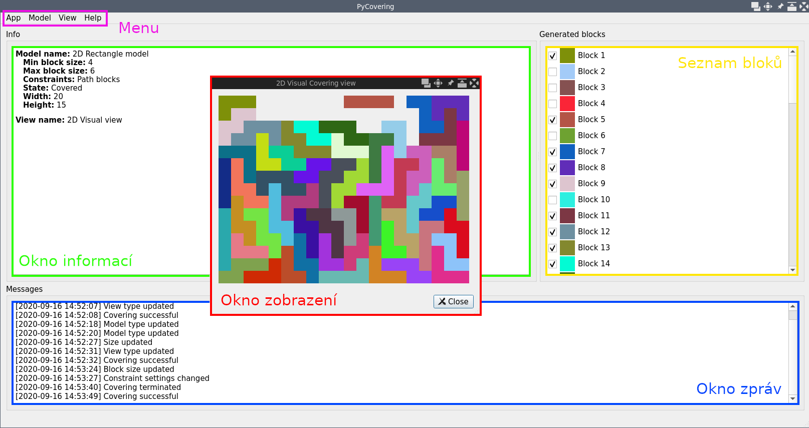

# pyCovering
_(Tento program je zápočtovým programem z předmětu Programování II. na MFF UK.)_

**pyCovering** je open-source generátor a vizualizátor dílků pyramidových
a obdélníkových hlavolamů, jejichž zadáním je vygenerované dílky poskládat
tak, aby vytvořili původní tvar.

**Programátorská dokumentace** je dostupná na [samostatné stránce](DEV_DOCS.md).


## Minimální požadavky
- Python verze **alespoň 3.6**
- [Podporovaný systém](https://wiki.qt.io/Qt_for_Python) Qt for Python

## Instalace

_(Příklady jsou uváděny pro OS Linux, ale obdobným způsobem je možné
program instalovat i na ostatních platformách)_

1) Naklonujte tento repozitář na svůj počítač.
```
$ git clone https://github.com/Jakoma02/pyCovering.git
```

2) Přejděte do složky s repozitářem.
```
$ cd pycovering
```

3) _(Volitelné)_ Aktivujte `virtualenv`
```
$ python3 -m venv venv
$ source ./venv/bin/activate
```

4) Nainstalujte program pomocí nástroje pip.
```
$ python3 -m pip install .
```

## Použití
Program je možné využívat ve dvou režimech:

 1) V příkazové řádce pomocí `pycovering-cli`
 2) V grafickém rozhraní `pycovering`

### Příkazová řádka
```
pycovering-cli {2d,pyramid} <model-arguments>
```

Argumenty se liší podle zvoleného modelu/tvaru.

1) Obecné argumenty
   - `--help/-h` zobrazí nápovědu programu nebo zvoleného modelu
   - `--verbose/-v` zvýší verbositu, možné použít i `-vv`

2) Argumenty modelu
   - `--min-block-size/-mib <int>` nastaví nejmenší velikost bloku,
		který smí být při pokrývání použit
   - `--max-block-size/-mab <int>` nastaví největší velikost bloku,
		který smí být při pokrývání použit
   - `--height <int>` _(pouze 2d)_ nastaví výšku pokrývaného obdélníka
   - `--width <int>` _(pouze 2d)_ nastaví šířku pokrývaného obdélníka
   - `--size/-s <int>` _(pouze pyramid)_  nastaví velikost pokrývané pyramidy
   - `--path` používá při pokrývání pouze dílky, které jsou cestami
   - `--planar` _(pouze pyramid)_ používá při pokrývání pouze dílky,
		které leží v jedné rovině

3) Argumenty vizualizace
   - `--visual` místo v terminálu otevře grafické okno, ve kterém výsledek
	znázorní

#### Ukázkové použití
```
$ pycovering-cli 2d --width 8 --height 10 -mib 2 -mab 6 --path
 1  1  2  2  3  3  4  4 
 1  5  5  2  6  6  4  7 
 1  8  8  2  9  9  9  7 
 1  1  8  2  2  10 9  7 
 11 11 12 12 10 10 9  7 
 13 12 12 14 14 14 7  7 
 13 15 15 15 16 16 16 17
 13 15 18 18 16 19 16 17
 13 20 18 21 21 19 22 17
 13 20 18 18 18 22 22 17
```

### Grafické rozhraní


#### Typické použití

1) V menu zvolte `Model` a  vyberte požadovaný typ/tvar modelu.
2) Ve stejné nabídce nastavte požadované vlastnosti modelu: velikosti
	generovaných bloků, dimenze modelu a případná omezení (constraints).
3) V nabídce `View` vyberte požadovaný způsob zobrazení.
4) Zahajte pokrývání modelu volbou `App` > `Cover` a vyčkejte na dokončení
	pokrývání.
5) V seznamu bloků pomocí zaškrtávacích políček vyberte, které bloky
	se mají zobrazovat.
