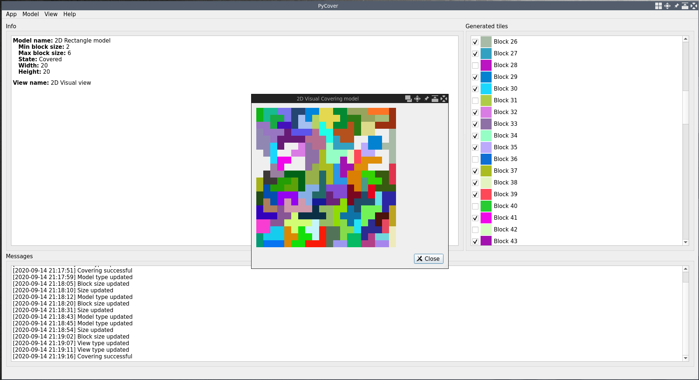

# pyCovering
_(Tento program je zápočtovým programem z předmětu Programování II. na MFF UK.)_

**pyCovering** je open-source generátor a vizualizátor dílků pyramidových
a obdélníkových hlavolamů, jejichž zadáním je vygenerované dílky poskládat
tak, aby vytvořili původní tvar.



## Minimální požadavky
- Python verze **alespoň 3.6**

## Instalace

_(Příklady jsou uváděny pro OS Linux, ale obdobným způsobem je možné
program instalovat i na ostatních platformách)_

1) Naklonujte tento repozitář na svůj počítač.
```
$ git clone https://github.com/Jakoma02/pyCovering.git
```

2) Přejděte do složky s repozitářem.
```
$ cd pycovering
```

3) _(Volitelné)_ Aktivujte `virtualenv`
```
$ python -m venv venv
$ source ./venv/bin/activate
```

4) Nainstalujte program pomocí nástroje pip.
```
$ pip install .
```

## Použití
Program je možné využívat ve dvou režimech:

 1) V příkazové řádce pomocí `pycovering-cli`
 2) V grafickém rozhraní `pycovering`

### Příkazová řádka
```
pycovering-cli {2d,pyramid} <model-arguments>
```

Argumenty se liší podle zvoleného modelu/tvaru.

1) Obecné argumenty
   - `--help/-h` zobrazí nápovědu programu nebo zvoleného modelu
   - `--verbose/-v` zvýší verbositu, možné použít i `-vv`

2) Argumenty modelu
   - `--min-block-size/-mib <int>` nastaví nejmenší velikost bloku,
		který smí být při pokrývání použit
   - `--max-block-size/-mab <int>` nastaví největší velikost bloku,
		který smí být při pokrývání použit
   - `--height <int>` _(pouze 2d)_ nastaví výšku pokrývaného obdélníka
   - `--width <int>` _(pouze 2d)_ nastaví šířku pokrývaného obdélníka
   - `--size/-s <int>` _(pouze pyramid)_  nastaví velikost pokrývané pyramidy
   - `--path` používá při pokrývání pouze dílky, které jsou cestami
   - `--planar` _(pouze pyramid)_ používá při pokrývání pouze dílky,
		které leží v jedné rovině

3) Argumenty vizualizace
   - `--visual` místo v terminálu otevře grafické okno, ve kterém výsledek
	znázorní
